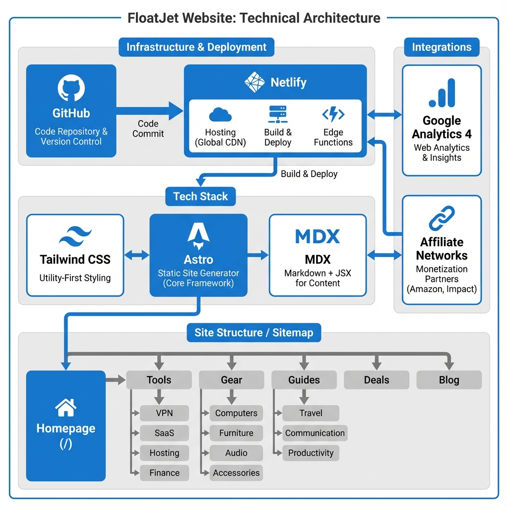
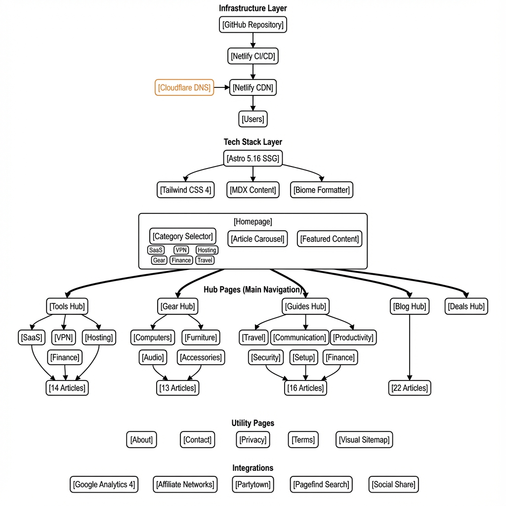

# FloatJet

Yeah, I help remote workers find tools that don't suck.

Look, you're working from a coffee shop in Bali or your kitchen table in Brooklyn—doesn't matter. What matters? Having
the right setup so you can actually get work done. Not spending three days comparing VPNs or wondering if that $400
standing desk is worth it.

That's what this site does.

---

## What you'll find here

**Tools** - VPNs that actually work when you need them. Project management software that won't make your team hate you.
Cloud storage that doesn't randomly eat your files. You know, the basics.

**Gear** - Laptops, monitors, chairs that won't destroy your back, standing desks (yes, they're worth it sometimes),
headphones that actually cancel noise, webcams that don't make you look like a potato. All tested. Honestly reviewed.

**Guides** - Productivity stuff that works in real life. Security practices that aren't paranoid overkill. How to set up
your home office without going broke. Finance tips for when you're getting paid in three different currencies. Travel
advice from someone who's actually done it.

**Blog** - Remote work trends, team communication (the good and the deeply weird), digital nomad lifestyle reality
checks.

---

## Under the hood

Okay so if you're here to see how this thing is built:

### What's running this

**Core stuff:** Astro 5, MDX (because writing in markdown is just... better)

**Making it pretty:** Tailwind CSS 4

**Fonts:** Self-hosted via @fontsource. Outfit for headings, Inter for body text, JetBrains Mono for code. Loaded from
my server, not Google's.

**Search:** Pagefind. Static site search that's actually fast.

**Performance tricks:** astro-compress, astro-purgecss, Partytown (keeping those analytics scripts from tanking page
speed)

**SEO:** astro-sitemap, astro-robots-txt, astro-opengraph-images (gotta feed those social media previews)

**Where it lives:** Netlify. Deploy on push. Zero config. Works.

**Analytics:** Google Analytics 4 (yeah, I know)

### Architecture if you're into that

---

## The mission

Remote work should be simple.

Not "attend a webinar about productivity frameworks" simple. Just... you find a tool, it solves your problem, you move
on with your life.

Most review sites are affiliate link factories. They'll recommend 15 different VPNs as "the best" depending on which
page you land on.

This site? I use this stuff. I test it in actual situations—terrible cafe wifi, international banking nightmares, trying
to look professional on video calls while my neighbor mows his lawn.hen I tell you what works.

---

## Check it out

**Website:** [floatjet.com](https://floatjet.com)

Come for the VPN reviews, stay for the chair recommendations. Or whatever.

---

Copyright (c) 2025 FloatJet. All rights reserved.
