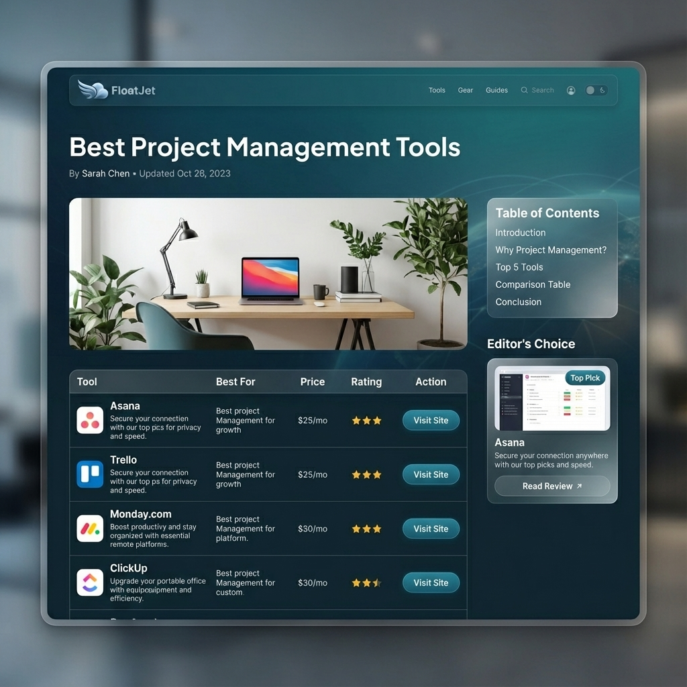

# FloatJet Article Page Design Concept

## Visual Strategy

The article page (Money Page) is designed to maximize readability and conversion while maintaining the premium "
FloatJet" brand aesthetic.

## Key Design Elements

- **Consistency:** Uses the exact "Ocean Deep" (#0F4C5C) and "Jet Stream" (#38A3A5) palette from the homepage.
- **Layout:** Classic 2-column layout (Content + Sidebar) for desktop, collapsing to single column for mobile.
- **Typography:**
    - **Headings:** `Outfit` (Bold) for distinct, modern character.
    - **Body:** `Inter` (Regular) for frictionless long-form reading.
- **Conversion Elements:** High-contrast teal buttons and clear comparison tables to drive affiliate clicks.
- **Glassmorphism:** Used in the sidebar (Table of Contents) to provide depth without clutter.

## Mockup

